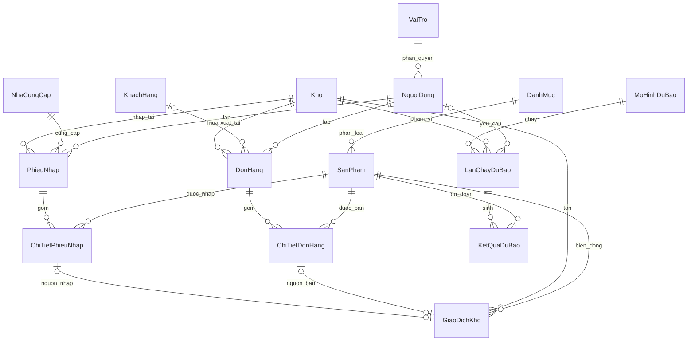

# Thiết kế cơ sở dữ liệu

Thiết kế nền tảng theo phạm vi đã chọn: bán hàng, kho và dự báo doanh số. Dự án chưa có đặc tả nghiệp vụ chi tiết nên phiên bản này dùng các giả định dưới đây.

## Quy ước nghiệp vụ

- Một phiếu nhập hoặc đơn bán thuộc một kho. Một sản phẩm xuất hiện tối đa một dòng trong mỗi chứng từ.
- Số lượng hàng là số nguyên dương (hàng đếm theo cái/hộp); chưa hỗ trợ hàng cân theo số lẻ.
- Giá và doanh thu tính bằng VND, kiểu `decimal`, không dùng số thực. `GiamGia` là tổng giảm giá của cả dòng, không phải phần trăm hoặc giảm giá mỗi đơn vị.
- Giá nhập/giá bán được lưu tại dòng chứng từ để giữ lịch sử khi giá sản phẩm thay đổi.
- Khách hàng có thể để trống cho bán lẻ; phiếu nhập phải có nhà cung cấp và người lập.
- Doanh số chỉ ghi nhận khi đơn `HoanTat`; chưa tách thanh toán/công nợ. Chưa hỗ trợ thuế, phí vận chuyển, trả hàng, chuyển kho, kiểm kê, lô/hạn dùng hoặc hoàn tác chứng từ đã ghi sổ.
- Ngày nghiệp vụ dùng `date`, do ứng dụng chọn theo ngày kinh doanh tại Việt Nam. Thời điểm hệ thống mới dùng UTC `datetime2`; hai bảng đăng nhập giữ `datetime` cho tương thích. Seeder hiện hữu dùng giờ máy cho ngày tạo tài khoản.
- Tồn kho hiện tại được tổng hợp từ giao dịch đã ghi sổ. Bản này không kiểm soát tồn âm tại từng thời điểm lịch sử khi cho phép nhập chứng từ lùi ngày; ứng dụng cần chính sách khóa kỳ nếu có yêu cầu đó.

## Danh sách bảng

| Nhóm | Bảng | Mục đích |
|---|---|---|
| Phân quyền | VaiTro | Admin, Quản lý kho, Nhân viên bán hàng |
| Phân quyền | NguoiDung | Thông tin tài khoản, email duy nhất, mật khẩu băm BCrypt |
| Danh mục | DanhMuc | Nhóm sản phẩm |
| Danh mục | SanPham | SKU duy nhất, đơn vị tính, giá hiện hành |
| Kho | Kho | Danh sách kho |
| Đối tác | KhachHang | Khách mua hàng |
| Đối tác | NhaCungCap | Đơn vị cung cấp hàng |
| Nhập hàng | PhieuNhap | Đầu phiếu nhập, trạng thái, ngày nhập |
| Nhập hàng | ChiTietPhieuNhap | Sản phẩm, số lượng và giá nhập |
| Bán hàng | DonHang | Đầu đơn bán, khách hàng, kho, người lập |
| Bán hàng | ChiTietDonHang | Số lượng, giá bán lịch sử và giảm giá |
| Tồn kho | GiaoDichKho | Sổ giao dịch nhập dương / bán âm, tham chiếu dòng chứng từ |
| Dự báo | MoHinhDuBao | Tên thuật toán, phiên bản, tham số JSON |
| Dự báo | LanChayDuBao | Kho, khoảng dữ liệu huấn luyện, khoảng dự báo, trạng thái, MAE/RMSE |
| Dự báo | KetQuaDuBao | Số lượng và doanh thu dự báo theo sản phẩm/ngày/lần chạy |
| Kỹ thuật | SchemaVersion | Phiên bản lược đồ đã triển khai |
| Xác thực | PhienDangNhap | Phiên JWT và thời điểm thu hồi khi đăng xuất |

## Quan hệ



## Cách dùng nhập kho và bán hàng

1. Tạo chứng từ mặc định `TrangThai = 'Nhap'`, thêm các dòng chi tiết.
2. Gọi thủ tục tương ứng bằng tham số, không cập nhật trạng thái hoàn tất trực tiếp:

```sql
-- Thay mã bằng chứng từ thực tế đã tạo.
EXEC dbo.usp_XacNhanPhieuNhap @MaPhieuNhap = 1;
EXEC dbo.usp_HoanTatDonHang @MaDonHang = 1;

SELECT * FROM dbo.vw_TonKho;
SELECT * FROM dbo.vw_TongTienDonHang;
SELECT * FROM dbo.vw_DoanhSoTheoNgay ORDER BY NgayBan, MaKho, MaSanPham;
```

Thủ tục kiểm tra chứng từ có sản phẩm, kho/sản phẩm đang hoạt động, kiểm tra tồn trước bán, dùng transaction và khóa ứng dụng theo kho. Gọi lại chứng từ đã ghi sổ không tạo giao dịch mới. Ràng buộc duy nhất trên nguồn giao dịch cũng ngăn ghi nhận hai lần. Dòng chứng từ và chứng từ đã xác nhận/hủy bị khóa sửa/xóa; giao dịch kho không được sửa/xóa.

Các procedure tự quản lý transaction; khi thất bại chúng rollback toàn bộ transaction đang chạy. Nên gọi chúng như một đơn vị nghiệp vụ độc lập, tránh gộp với thao tác không liên quan. Ứng dụng có thể retry khi gặp deadlock hoặc hết thời gian chờ khóa.

Không lưu một cột tồn kho riêng dễ lệch số; `vw_TonKho` trả tổng `bigint` theo kho/sản phẩm đã phát sinh giao dịch. Sản phẩm chưa phát sinh giao dịch không có dòng trong view: dùng LEFT JOIN và COALESCE(..., 0) nếu cần hiển thị tất cả sản phẩm.

Vai trò SQL `SalesForecastApp` đã có quyền đọc, sửa dữ liệu danh mục/chứng từ nháp và gọi thủ tục ghi sổ; không được ghi trực tiếp `GiaoDichKho` hoặc sửa cột trạng thái. Chưa gán login vào role và chưa thay tài khoản Windows đang dùng. Khi triển khai tài khoản ứng dụng riêng, tạo database user và thêm vào role này; không cấp thêm `db_owner`/`db_datawriter`. Quyền quản lý tài khoản và tạo Admin cần một luồng quản trị riêng. Người dùng sysadmin có thể vượt quyền ứng dụng nên khi thao tác trong SSMS vẫn phải gọi các procedure.

Trạng thái `Huy` được dành sẵn trong mô hình; bản này chưa cung cấp procedure hủy cho role ứng dụng. Chỉ xóa chứng từ nháp theo thứ tự chi tiết trước, đầu chứng từ sau. Không có cascade delete dữ liệu lịch sử.

## Cách dùng dữ liệu dự báo

`vw_DoanhSoTheoNgay` là nguồn lịch sử bán hàng đã hoàn tất theo kho/sản phẩm/ngày. View chỉ có những ngày phát sinh doanh số; bước chuẩn bị dữ liệu phải tạo lịch ngày liên tục và điền 0 cho ngày không bán trong phạm vi sản phẩm đang kinh doanh, phân biệt với dữ liệu bị thiếu hoặc hết hàng.

Đăng ký mô hình/phiên bản trong `MoHinhDuBao`, tạo `LanChayDuBao`, chạy thuật toán ngoài SQL Server rồi lưu `KetQuaDuBao`. Khoảng huấn luyện phải kết thúc trước ngày đầu dự báo để hạn chế rò rỉ dữ liệu tương lai. Ngày kết quả phải nằm trong khoảng dự báo. Khoảng bất định `CanDuoi`/`CanTren` tùy chọn áp dụng cho số lượng; nếu có phải bao quanh số lượng dự báo.

MAE/RMSE ở lần chạy dành cho sai số số lượng trên tập kiểm định; cần quy định cùng cách tổng hợp khi so sánh mô hình. Hệ thống lưu kết quả dự báo, chưa tự huấn luyện, chưa chạy lịch định kỳ, chưa có dịch vụ Python hoặc dữ liệu mẫu huấn luyện.

## Kiểm chứng

`003_verify.sql` kiểm tra nhập 10 → bán 3 → tồn 7, doanh thu sau giảm giá 28.000; gọi xác nhận hai lần không tăng/trừ kho lặp; từ chối bán 11 khi tồn 10; từ chối sửa chi tiết đơn đã hoàn tất; từ chối số lượng 0; từ chối ngày dự báo ngoài phạm vi.

Các dữ liệu kiểm thử đều rollback, chỉ giữ ba vai trò cơ bản sau cài đặt. SQL Server có thể tiêu thụ giá trị IDENTITY dù transaction rollback nên mã tự tăng có thể bắt đầu lớn hơn 1; không dùng mã liên tục làm giả định nghiệp vụ. Bộ kiểm thử này chưa mô phỏng tải bán đồng thời từ nhiều kết nối.
